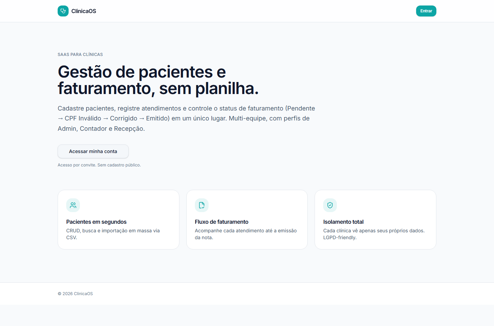
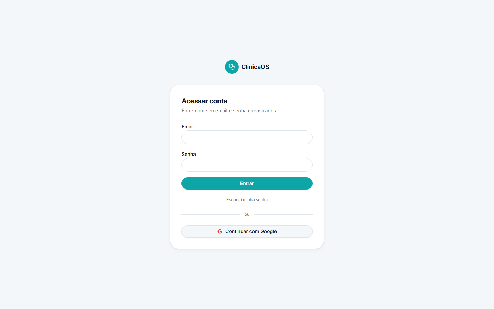

<div align="center">

# ClinicaOS

**Patient, attendance and billing management for clinics — multi-tenant and protected by row-level security.**


[Português](./README.md) · English

</div>

## About

Small and mid-size clinics still run patients, appointments and invoice issuance out of shared spreadsheets. The problems show up quickly: nobody knows which appointment has already been billed, a patient's tax ID is wrong in a dozen rows at once, and — worse — health data from several companies sits in one file with no isolation and no record of who changed what.

ClinicaOS is a multi-tenant B2B SaaS that fixes this with an explicit billing workflow — **Pending → Invalid CPF → Corrected → Issued** — layered on top of patient records, an appointment history and clinic team management. Each clinic only sees its own data, enforced by Supabase row-level security policies plus a role check in every server function. Accounts are created by invite (no public sign-up), and each clinic has a subscription expiry managed from a global admin panel.

This is a project built to run in production for real: server-side rendering executed on the edge (Cloudflare Workers), authorization in three layers (database, server and route), automated tests over the access rules, audit logging of sensitive operations, encrypted backups of clinic data and dedicated error pages.

## Demo

**Live:** [https://clinica-os-mdm24.vercel.app](https://clinica-os-mdm24.vercel.app) — SSR on Vercel backed by Supabase (RLS).





## Features

- **Public landing page** (`/`) — product overview with invite-only access and no public sign-up.
- **Authentication** — email and password, Google social login (OAuth), password recovery and first-access password setup (`/aceitar-convite`).
- **Five roles** — `super_admin`, `admin`, `operador`, `contador` and read-only `usuario`, backed by route guards and per-function role assertions.
- **Billing dashboard** — appointment list filtered by year, month and day, plus cards for total billed, pending, invalid CPF and issued.
- **Role-aware status flow** — the statuses `Pendente`, `CPF Inválido`, `Corrigido`, `Emitido` and `Cancelado` are enforced by a table constraint on `attendances`, and each role only sees the transitions it is allowed to perform.
- **Patient management** — CRUD with CPF, CNPJ, company name and parent information; name search; bulk CSV import; detail page with the patient's appointment history.
- **Appointments** — create, edit and delete, with bill-to selection (patient, father, mother or company CNPJ), payment method, value and date.
- **Clinic team** (`/equipe`) — invite members, change roles and remove them (admin only).
- **Backups** (`/backups`) — daily automatic snapshot (03:00), AES-256-GCM encryption, 30/90/365-day retention, manual generation, download and restore, plus a protected webhook for scheduled runs.
- **Global admin panel** (`/master-admin`) — create a clinic together with its admin, edit, activate/deactivate and set the subscription expiry.
- **Audit logs** (`/master-admin.logs`) — filters by clinic, action, email and date range, retention settings and CSV export.
- **Audit & LGPD (Brazilian GDPR)** — audit records on sensitive operations, patient data export and anonymization, consent records and soft deletion of appointments.
- **State pages** — 404, a custom server error page and a block screen for inactive or expired clinics.

## Stack

| Technology | What it is used for |
| --- | --- |
| [TanStack Start](https://tanstack.com/start) | SSR with file-based routes, server functions and middleware |
| [TanStack Router](https://tanstack.com/router) | Type-safe navigation with route guards and automatic redirects |
| [TanStack Query](https://tanstack.com/query) | Caching and invalidation of queries and mutations |
| React 19 | UI and application hooks |
| Vite 7 | Dev server and production build |
| Cloudflare Workers | Edge runtime for the SSR (`wrangler.jsonc`) |
| Supabase | Postgres database, authentication, storage and RLS |
| Tailwind CSS v4 | Utility styling with theme variables |
| shadcn/ui + Radix UI | Accessible components in the "new-york" style |
| Zod | Input validation for every server function |
| Vitest | Tests for access rules and utilities |
| Bun | Package manager and project scripts |
| Prettier + ESLint | Formatting and linting (with the Prettier plugin) |

## Project structure

```text
.
├── src/
│   ├── routes/                  # File-based routes (TanStack Router)
│   │   ├── __root.tsx           # HTML shell, meta, providers and error pages
│   │   ├── index.tsx            # Public landing page
│   │   ├── login.tsx            # Email/password and Google login
│   │   ├── aceitar-convite.tsx  # First access / password reset
│   │   ├── bloqueio.tsx         # Blocked or expired account
│   │   ├── master-admin.tsx     # Global clinic panel (super admin)
│   │   ├── master-admin.logs.tsx# Audit logs
│   │   ├── _app.tsx             # Authenticated layout (sidebar, session, logout)
│   │   ├── _app/                # dashboard, patients (list and detail), team, backups
│   │   └── api/public/hooks/    # Scheduled backup webhook
│   ├── components/              # Domain components (patient-combobox, row-actions)
│   │   └── ui/                  # shadcn/ui (CLI-generated)
│   ├── hooks/                   # use-session, use-mobile
│   ├── lib/                     # Business rules and server functions
│   │   ├── *.functions.ts       # Server functions callable from the client
│   │   ├── *.server.ts          # Server-only modules (service role, crypto)
│   │   └── *.test.ts            # Vitest tests (auth-guards, clinic-utils, rls-policies)
│   ├── integrations/
│   │   ├── supabase/            # Browser/server clients, auth middleware and DB types
│   │   └── lovable/             # Social login (Google OAuth)
│   ├── start.ts                 # Global middleware (errors + auth token forwarding)
│   ├── server.ts                # Server entry (errors rendered on a dedicated page)
│   └── styles.css               # Tailwind CSS v4 and theme variables
├── supabase/
│   ├── migrations/              # Schema, RLS policies, functions and triggers
│   └── config.toml
├── wrangler.jsonc               # Cloudflare Workers configuration
├── vite.config.ts               # Vite/TanStack Start configuration
├── vitest.config.ts             # Test configuration (node environment)
├── bunfig.toml                  # Bun supply-chain guard (24h release age)
└── AGENTS.md                    # Project conventions
```

## Getting started

### Prerequisites

- [Bun](https://bun.sh) — the package manager used by the project.
- A Supabase project with the migrations in `supabase/migrations` applied.
- (Optional) A Cloudflare Workers account for the production deploy.

### Installation

```bash
git clone https://github.com/<your_username>/clinica-os.git
cd clinica-os
bun install
cp .env.example .env   # fill in the values for your Supabase project
bun run dev
```

### Commands

| Command | What it does |
| --- | --- |
| `bun run dev` | Vite development server |
| `bun run build` | Production build (Cloudflare Workers) |
| `bun run build:dev` | Development-mode build |
| `bun run preview` | Preview the build |
| `bun run lint` | ESLint |
| `bun run format` | Prettier (formats the code) |
| `bun run test` | Vitest (single run) |
| `bun run test:watch` | Vitest in watch mode |

### Environment variables

The application reads the variables below (see `.env.example`):

| Name | Description |
| --- | --- |
| `VITE_SUPABASE_URL` | Supabase project URL used by the browser client |
| `VITE_SUPABASE_PUBLISHABLE_KEY` | Public key used in the browser (RLS applies) |
| `SUPABASE_URL` | Supabase URL used on the server (SSR and server functions) |
| `SUPABASE_PUBLISHABLE_KEY` | Public key used on the server to validate the session |
| `SUPABASE_SERVICE_ROLE_KEY` | Service role key, server-only — bypasses RLS and authenticates the backup webhook |
| `BACKUP_ENCRYPTION_KEY` | 32-byte key (base64, hex or text) used to encrypt backups with AES-256-GCM |

## Technical highlights

- **Tenant isolation in the database.** Every business table carries a `clinic_id` and is covered by Supabase row-level security policies. The browser client uses the public key, so it can only ever read its own clinic's data; the service role key is confined to `*.server.ts` modules.
- **Authorization in three layers.** RLS policies in Postgres, role assertions inside server functions (`assertAdminRole`, `assertPatientWriter`, `assertAttendanceWriter`, `assertStaffRole`) and route guards (`requireAppSession`, `requireSuperAdminSession`) that redirect to login, the block screen or the global panel as appropriate.
- **Role-aware billing transitions.** Status changes are not a generic button: each role only receives the transitions it may perform (for example, the accountant issues invoices and flags invalid CPFs, while admin and operator correct them), and the super admin is excluded from clinical data.
- **SSR running on the edge.** TanStack Start with server functions, a global error middleware (custom page on status 500) and auth token forwarding to server calls, compiled to Cloudflare Workers.
- **Automated tests on the access rules.** Vitest covers `auth-guards`, `clinic-utils` and the RLS/role matrix — exactly the kind of logic that usually breaks silently.
- **Audit and LGPD compliance.** A `log_audit` function recording sensitive operations, patient data export and anonymization, a consents table, soft deletion of appointments and the removal of super admin access to clinical data.
- **Encrypted, versioned backups.** AES-256-GCM snapshots with a checksum, per-clinic versioning, configurable retention, restore and a scheduled-run webhook authenticated by the service key.
- **Code quality.** Zod validation on every server function, standardized errors in their own module, ESLint + Prettier and a Bun supply-chain guard (packages must be at least 24h old).

## License

Licensed under the MIT License.
